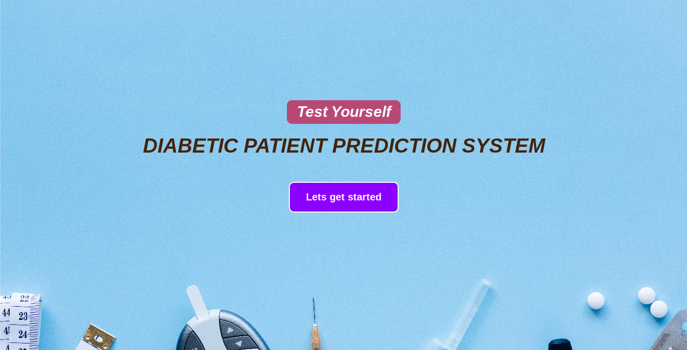

# *Diabetes Prediction Django App with Machine Learning*
A Machine Learning Project using Scikit-learn, Numpy, Pandas and Seaborn Deployed in A Django Web Framework To Predict 
Diabetist Based on PIMA diabetes dataset.

# *ML Algorithm:*
The [Logistic Regression Algorithm](https://www.mastersindatascience.org/learning/machine-learning-algorithms/logistic-regression/)  was used for the classification of the input data.

# *Data Set Information:*
The data set consists of 768 individuals. It has 7 independent features and 1 dependent which is the "Outcome" if the individual is diabetic or not 
represented by 1's and 0's.

The columns of the data set is described below:
* __Pregnancies__: Number of Times A Person has become Preganant.
* __Glucose__: Measurement of Plasma Glucose Concentration for 2 hours in an Oral Glucose Tolerance test.
* __Blood Pressure__: Diastolic Blood Pressure in mmHg unit.
* __Skin Thickness__: Measurement of Tricep Skinfold Thickness in mm.
* __Insulin__: Measurement of 2 hour serum insulin produced in U/ml.
* __BMI__: Body Mass Index.
* __Diabetes Pedigree Function__: Likelihood of having diabetes based on Family History.
* __Age__: Age of A Person in Years.
* __Outcome__: Class of a person being a diabetic or not.

# Requirements:
Setup first a virtual environment
* `pip install virtualenv`
then, activate it,
* `source name_of_env/bin/activate`

See __requirements.txt__ file for the list of requirements.
Or you can direct install to terminal:
1. Install Django with `pip install django`.
2. Install Pandas which will automatically install Numpy `pip install pandas`.
3. Next is seaborn, `pip install seaborn`.
4. Install scikit-learn, `pip install scikit-learn`.

# Runserver Steps:
1. Make sure to `cd` inside `diapredict` project folder.
2. Then run this in terminal `python manage.py runserver`.
3. You'll see a port that will direct you in your default browser: http://127.0.0.1:8000/
4. Click it and Voila!

# Interface

# Let's get Started
Put all your information and test it.

# Collaborations:
I'm open for collaborations, please shoot me an email at robinignaciosky70@gmail.com
